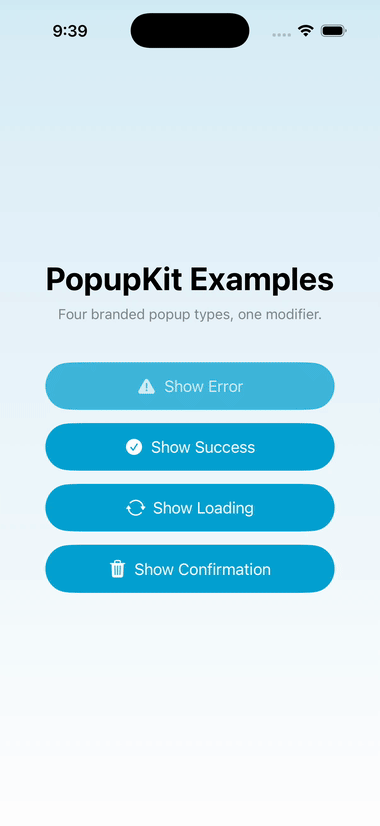

# PopupKit

A SwiftUI-native library for branded modal popups — Error, Success,
Loading, and Generic confirmation — behind one simple view modifier.



## Why

Most popular iOS popup/alert libraries predate SwiftUI and carry a
UIKit-first API. Compared to the two closest SwiftUI-native
alternatives on awesome-ios (`exyte/PopupView`, `Mijick/Popups`),
PopupKit is smaller in scope by design — four fixed types, no
stacking/queueing — but matches their two headline capabilities,
multiple presentation positions and drag-to-dismiss, while going
further on accessibility: every popup carries a VoiceOver
`accessibilityLabel`, is announced on appearance, and respects Reduce
Motion automatically.

## Installation

Swift Package Manager, via Xcode: File → Add Package Dependencies, then
enter this repository's URL.

Or in `Package.swift`:

```swift
dependencies: [
    .package(url: "https://github.com/sbrelesky/popupkit", from: "1.0.0")
]
```

## Usage

```swift
import PopupKit

struct ContentView: View {
    @State private var showError = false

    var body: some View {
        Button("Do something risky") {
            showError = true
        }
        .frame(maxWidth: .infinity, maxHeight: .infinity)
        .popupKit(isPresented: $showError, content: .error(message: "Something went wrong."))
    }
}
```

> **Note:** `.popupKit` presents as an overlay sized to the view it's
> attached to, not the whole screen — the same way `.overlay` itself
> behaves. Attach it to a view that already fills the screen (as above)
> so the dimmed background covers the full display.

## Popup types

- `.error(message:)`
- `.success(message:)`
- `.loading(message:)` — not dismissible by the user; clear it by setting `isPresented = false` when your async work finishes.
- `.generic(title:message:primaryAction:secondaryAction:)`

## Position & drag-to-dismiss

Every popup type has a sensible default position — `.error` and
`.success` appear as top banners, `.loading` and `.generic` appear
centered — and every dismissible popup (all but `.loading`) can be
dragged away along its position's axis: top-positioned popups drag up,
centered and bottom-positioned popups drag down.

Override the default when you need to:

```swift
.popupKit(
    isPresented: $showSuccess,
    content: .success(message: "Saved."),
    position: .bottom
)
```

Reduce Motion is respected automatically — all transitions collapse to
a plain fade when enabled.

## Theming

```swift
someView.popupTheme(
    PopupTheme(accentColor: .purple, cornerRadius: 24)
)
```

Set once, applies to every PopupKit popup below it in the view hierarchy.

`PopupTheme` also lets you customize icon colors and fonts:

```swift
PopupTheme(
    errorIconColor: .orange,
    successIconColor: .mint,
    titleFont: .system(.headline, design: .rounded),
    messageFont: .custom("YourFont-Regular", size: 16)
)
```

`titleFont` and `messageFont` take a `Font`, so you can pass either a
system design variant or a bundled custom font.

> **Note:** `.popupTheme` only affects `.popupKit` calls it's an
> ancestor of in the view hierarchy — apply it at the root of your app
> (e.g. on the view passed to `WindowGroup`) rather than after your
> `.popupKit` calls, or the popups won't see it.

## Example app

See `Examples/PopupKitExample` for a runnable demo of all four types.

## License

MIT — see [LICENSE](LICENSE).
